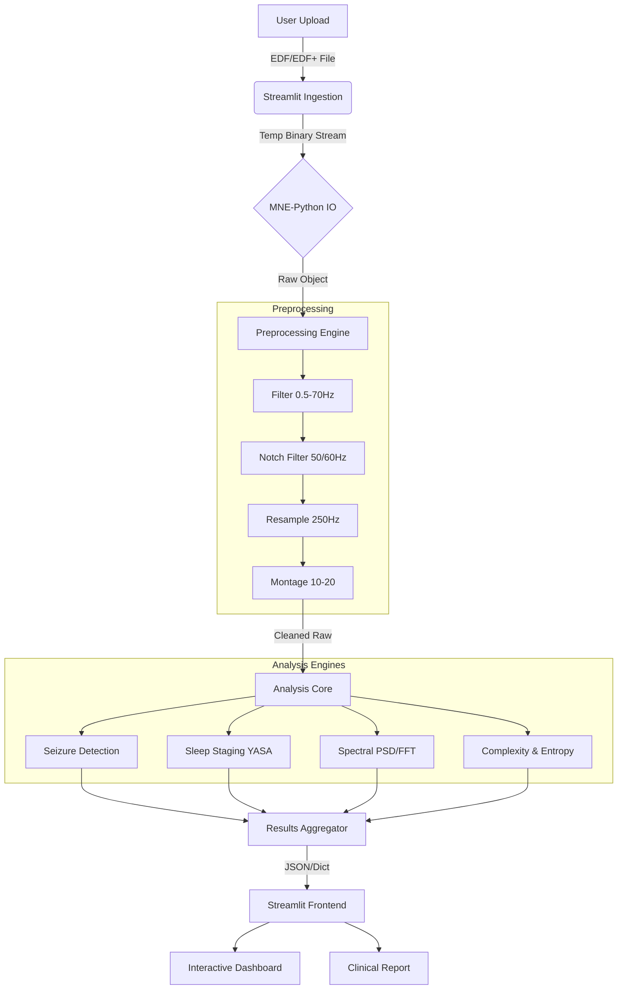

# NeuroVision EEG Pro ⚡
### Next-Generation Clinical EEG Analysis Suite

**NeuroVision EEG Pro** is an advanced, medical-grade application designed to bridge the gap between raw EEG data and actionable clinical insights. Built for neurologists, researchers, and data scientists, it combines powerful signal processing algorithms with an intuitive, interactive interface to assist in the interpretation of electroencephalography (EEG) recordings.

<details> <summary>📸 Click to view application screenshots</summary> <br>
Clinical Dashboard


EEG Viewer Interface


Spectral Analysis


Sleep Staging


Connectivity Mapping


Seizure Detection


Clinical Report


Non-Linear Analysis


</details>


## 🏥 For Medical Professionals & Clinicians

NeuroVision EEG Pro acts as an intelligent assistant, pre-screening EEG data to highlight events of interest, assess signal quality, and quantify brain dynamics.

### Key Features & Modules

#### 1. Clinical Dashboard 📊
The command center of the application, providing an immediate overview of the recording:
- **Automated Alerts**: Instantly flags potential **seizure activity**, **spike-wave complexes** (typical of absence seizures), and high artifact levels.
- **Signal Quality Check**: Monitors Signal-to-Noise Ratio (SNR) and electrode impedance indicators.
- **Hemispheric Asymmetry**: Automatically detects power imbalances between left and right brain hemispheres (crucial for localizing lesions).
- **Quick Insights**: Displays the dominant brain rhythm (Alpha, Beta, Theta, Delta) and Alpha Reactivity (visual cortex response to eye closure).

#### 2. Advanced EEG Viewer 📈
A fully interactive digital polysomnograph:
- **Montage Selection**: Switch instantly between **Referential**, **Bipolar (Longitudinal/Transverse)**, and **Average Reference** montages.
- **Navigation**: Zoom, pan, and scroll through recordings with high precision.
- **Filtering**: Apply clinical standard filters (0.5-70 Hz Bandpass, 50/60 Hz Notch) to clean signals.
- **Region Grouping**: Auto-groups channels by brain region (Frontal, Temporal, Parietal, Occipital) for focused analysis.

#### 3. Automated Analysis Suite 🔬
Quantifiable metrics to support visual interpretation:
- **Seizure Detection**: Uses multi-feature analysis (Line Length, Energy, Hjorth Parameters) to identify epileptiform patterns.
- **Sleep Staging**: Automatic hypnogram generation using the YASA algorithm (Wake, N1, N2, N3, REM).
- **Spectral Analysis**: Decomposes signals into frequency bands (Delta, Theta, Alpha, Beta, Gamma) to visualize power distribution.
- **Connectivity Mapping**: Visualizes functional connectivity between brain regions using correlation matrices.
- **Non-Linear Dynamics**: Calculates **Hjorth Complexity**, **Spectral Entropy**, and **Fractal Dimension** to assess signal chaoticity (often altered in pathology).

#### 4. Clinical Report Generator 📋
Generates a structured, text-based summary including:
- Patient & Recording Information.
- Technical Quality Assessment.
- Clinical Findings (Seizures per minute, sleep efficiency, asymmetry index).
- Automated Interpretations & Recommendations.

---

## 💻 For Developers & Technical Engineers

NeuroVision EEG Pro is a high-performance scientific application built on the **Python** ecosystem. It leverages industry-standard libraries for biomedical signal processing, wrapping them in a reactive **Streamlit** frontend.

### 🏗️ Technical Architecture

The application follows a linear data flow pipeline optimized for clinical safety and performance:

1.  **Ingestion Layer**: `streamlit.file_uploader` streams binary EDF data to a temporary buffer.
2.  **IO Layer**: `mne.io.read_raw_edf` reads the data, parsing header info (sampling rate, channels, timestamp) and signal data.
3.  **Preprocessing Engine**:
    *   **Montage Creation**: Maps channels to standard 10-20 system locations.
    *   **Filtering**: Zero-phase FIR filters (via `scipy.signal`) for Bandpass (0.5-70Hz) and Notch (50/60Hz).
    *   **Resampling**: Downsampling to 250Hz (Nyquist theorem compliance) for performance optimization.
4.  **Analysis Core**:
    *   **Time-Domain**: Statistical moments (Skewness, Kurtosis) and Hjorth Parameters.
    *   **Frequency-Domain**: Fast Fourier Transform (FFT) and Welch's Periodogram for Power Spectral Density (PSD).
    *   **Non-Linear**: Entropy calculations and fractal dimension estimation.
5.  **Presentation Layer**: `plotly.graph_objects` renders WebGL-accelerated interactive charts.

### � System Data Flow



### �📚 Comprehensive Dependency Stack

The project relies on a robust stack of scientific libraries. Here is a breakdown of their specific roles:

#### Core Framework & IO
*   **`streamlit` (v1.34+)**: The reactive web framework. Handles session state (`st.session_state`) key for persisting large EEG objects across re-runs.
*   **`pyedflib`**: The underlying C-binding library used by MNE to read European Data Format (EDF/EDF+) files efficiently.

#### Signal Processing & Neuroscience
*   **`mne` (MNE-Python)**: The backbone of the application. Handles:
    *   Data structures (`Raw`, `Epochs`).
    *   Sensor location mapping (Standard 10-20 montage).
    *   Artifact handling and bad channel interpolation.
*   **`scipy`**: Provides the fundamental DSP algorithms:
    *   `scipy.signal.butter`: Butterworth filter design.
    *   `scipy.signal.filtfilt`: Forward-backward signal filtering (zero phase shift).
    *   `scipy.signal.welch`: Power Spectral Density estimation.
    *   `scipy.signal.spectrogram`: Time-frequency analysis.
*   **`yasa` (Yet Another Spindle Algorithm)**: A specialized sleep analysis library. It uses pre-trained LightGBM classifiers to detect:
    *   Sleep Stages (Wake, N1, N2, N3, REM).
    *   Sleep Spindles & K-Complexes.
*   **`antropy`**: A dedicated library for computing complexity features:
    *   *Permutation Entropy* & *Sample Entropy* (measures of signal unpredictability).
    *   *Petrosian/Katz Fractal Dimension* (measures of signal roughness).
*   **`neurokit2`**: Used for extracting specific physiological features and additional signal cleaning routines.

#### Machine Learning & Statistics
*   **`scikit-learn`**: Used for:
    *   `StandardScaler`: Normalizing EEG signals for visualization and ML.
    *   `PCA`: Principal Component Analysis for dimensionality reduction (in advanced views).
*   **`statsmodels`**: Provides advanced statistical testing and time-series analysis (e.g., Autoregression models).
*   **`numpy`**: The foundation for high-performance array manipulation. All EEG data is manipulated as `float64` NumPy arrays.
*   **`pandas`**: Manages structured data for reports and metric tables.

#### Visualization
*   **`plotly`**: The primary engine for interactive plots. Uses WebGL to render high-density EEG traces without browser lag.
*   **`matplotlib` & `seaborn`**: Used for generating static, publication-quality statistical plots (histograms, correlation heatmaps) for the generated PDF reports.

### 🧠 Algorithmic Details

#### 1. Seizure Detection Heuristics
The integrated `detect_seizure_patterns()` function uses a multi-feature voting system:
*   **Line Length**: $\sum |x_{i} - x_{i-1}|$ (Sensitive to high-frequency, high-amplitude spiking).
*   **Hjorth Complexity**: Measures the similarity of the signal to a pure sine wave.
*   **Alpha/Beta Ratio**: Sudden shifts in this ratio often precede or accompany ictal events.
*   **Spike Detection**: Custom peak detection algorithm looking for sharp transients ($>5\sigma$ amplitude, $<70ms$ duration).

#### 2. Sleep Staging (YASA)
The application utilizes YASA's pretrained classifier which extracts ~50 features from the EEG (focusing on Central/Occipital channels) to predict sleep stages with ~85% accuracy compared to human consensus.

### ⚙️ System Requirements

Due to the size of uncompressed EEG data and the computational cost of spectral analysis:
*   **RAM**: Minimum 8GB required. 16GB+ recommended for files >1 hour.
*   **CPU**: Multi-core processor (Intel i5/Ryzen 5 or better) recommended for parallel FFT computations.
*   **Storage**: Fast NVMe SSD recommended for quick temporary file IO.

### 🔧 Installation & Setup

1.  **Clone the Repository**:
    ```bash
    git clone https://github.com/your-repo/neurovision-eeg.git
    cd neurovision-eeg
    ```

2.  **Create a Virtual Environment** (Highly Recommended):
    ```bash
    python -m venv venv
    # Windows
    .\venv\Scripts\activate
    # Mac/Linux
    source venv/bin/activate
    ```

3.  **Install Dependencies**:
    ```bash
    pip install -r requirements.txt
    ```

4.  **Run the Application**:
    ```bash
    streamlit run app.py
    ```
    *Note: The first run may take longer as it builds font caches and compiles JIT functions.*

---

> **⚠️ Disclaimer**: NeuroVision EEG Pro is intended for **research and educational purposes only**. It is not a certified medical device and should not be used as the primary basis for clinical diagnosis or patient management. All automated findings must be verified by a qualified clinical neurophysiologist.
